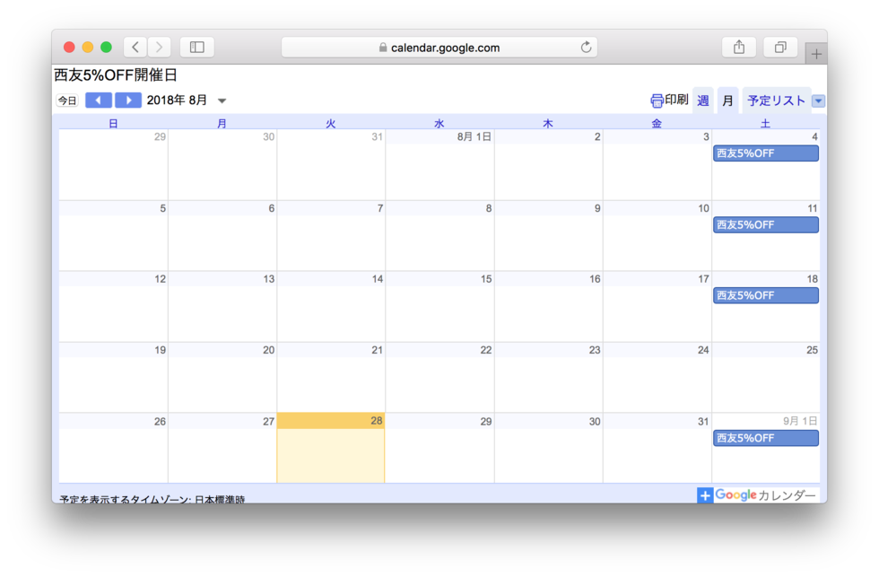

# seiyu-5off

> :calendar: 西友 5%OFF 開催日カレンダー

## Description

[西友 5%OFF 開催日カレンダー](https://www.seiyu.co.jp/service/5off/)から開催日をスクレイピングして、Google Calendar として公開しています。

- **Calendar ID**: `0s95g7m3irrcrabge49tlk6so0@group.calendar.google.com`
- **Public URL**: https://calendar.google.com/calendar/embed?src=0s95g7m3irrcrabge49tlk6so0%40group.calendar.google.com&ctz=Asia%2FTokyo

Google Calendar にて [友だちのカレンダーを追加] に Calendar ID を入力して追加するか、Public URL を開いて右下のボタンから追加できます。

## Internal

### `src/index.js`

- [西友 5%OFF 開催日カレンダー](https://www.seiyu.co.jp/service/5off/)から開催日をスクレイピングして、その結果を `data` ディレクトリ内に JSON として保存します。
  - 開催日のデータは、年毎に `YYYY.json` というファイル名で、日本時間の ISO 8601 形式の文字列の配列として保存しています。
- Travis CI cron job を使って 1 日に 1 回スクレイピングを行い、`data` ディレクトリに更新がある場合は `master` ブランチに直接 `push` しています。

### `src/functions/index.js`

- `data` ディレクトリ内の JSON から開催日を取得して、Google Calendar に登録します。
- Google Apps Script で動作し、1 日に 1 回実行しています。

## Special thanks

- @ushibutatory for [スーパーの5%OFF開催日をiCal形式で配信してGoogleカレンダーに表示してみた](https://qiita.com/ushibutatory/items/aa49fa2a85a7a0cbad0b)
- @hnw for [Travis CIのcron jobsを使ってGitHubに定期的にcommitする方法](http://d.hatena.ne.jp/hnw/20180706)

## License

[MIT](https://choosealicense.com/licenses/mit/)
